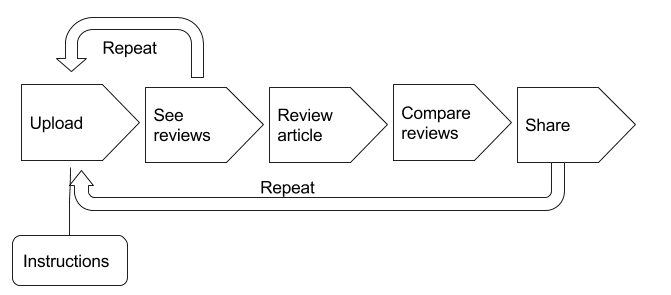
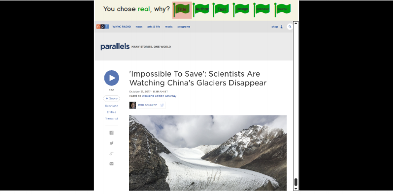

# Fake Me Out 

Andrea & Sinan
# Topic
This application is our effort to defend average media consumers against the spread of misinformation and to promote media literacy. Users are challenged to analyze and evaluate news articles and are trained to master skills and tools to authenticate credible sources. This site puts a question mark on the credibility of the information they come across online every day by fostering a spirit of skepticism.

# Problem
During last year’s presidential election campaign, false claims and accusations on both sides went viral on the internet, bringing the issue of ‘fake news’ under the spotlight. With the aid of social media platforms, fake news can now reach more people faster than anyone could have imagined before facebook or twitter. How can we tell the fact from fabrication in the digital age?
Attitude - Many media consumers are not aware of the problem of fake news. They may take whatever shows up on their news feed for granted, believe it without double-check and even contribute to the spread of false information unconsciously.
Skills - Media consumers are not able to identify the key parts that help people evaluate the credibility of news articles. They don’t know what and where to look at and are sometimes oblivious to some glaring indicators.  
# Target Audience
This app is geared for users ages 30 to 40 years. We chose this target audience for several reasons. Based on our initial paper prototype user testing, we found that 12 to 25 year olds find their news on Snapchat and our platform wouldn’t be conducive to this audience. We also found that they don’t feel that this issue relates to them. Whereas, 30 to 40 year olds are well aware of the issue and found that there is no tool out there to help them decipher whether news is fake or real while they are reading a news piece. In addition, there is an article that supports our user-testing data. According to spew Research, 21% of those ages 18-29 get news on @Snapchat; 2% of those 30-49 do. There is more data in this report [here](http://www.journalism.org/2017/09/07/news-use-across-social-media-platforms-2017/).
# User Stories
User Story 1:
Brian is a 40 year old man. He lives in Wayne, N.J. He is divorced and has a 14 year old daughter. When he wakes up he sits on the toilet and reads news on Google. He also watches the news every morning on TV. His preferred news channel is Good Morning America on ABC. He is very skeptical about all of the news he reads online. He doesn’t believe anything he reads online. Brian is aware of fake news but He is easily annoyed by spam phone calls. He uses an app called HiYa to help him detect spam and block those calls. This app is community-based and he enjoys reading other ratings because it helps him identify those spam callers. 
As a person who checks their news daily on the Internet, I want a tool to be able to help me determine whether news is fake or real. I’d like to be part of a community to see what others think about the article as well.

User Story 2:
Regina is married and she has two children. Every morning, she wakes up and checks her Google plus news feed and CNN news feed. She likes using those apps because she thinks they are more reputable than other news sources. She’s somewhat aware of the fake news issue but hasn’t really taken action about it. She’s looking for a way to determine real news from fake news. 
As a person who checks their news daily on the Internet, I want to be able to determine fake news from real.
# Strategy
## Site Objectives:
This site trains users to become mindful media consumers with sharp eyes, instilling a good sense of skepticism in them. They will be able to evaluate news by recognizing key indicators and develop a habit of questioning the source. They are prepared to make a more informed decision when it comes to what to believe, what to repost and what to share to their social network.  

## Success Metrics
(Re)use of the review function: To simply upload the news to our site indicates a sense of skepticism on the users’ part - that they start to ask questions. When they upload more articles and choose to review themselves they have already become critical news readers.    
Use of the share function: by sharing the news articles they review at out site they are raising awareness of the problem of fake news among their social networks. That they would share the site may suggest they feel the problem relevant and find our solution helpful in reducing misinformation within their social networks.

# Scope
- Users learn how the site works by reading instructions 
  - Brief introduction of our site and its purpose. 
  - Steps of the core feature - how to review news article on our site  
- Users check others’ reviews of new article
  - Upload the url of news article
  - See article
  - See others’ reviews of news article
- Users review news article
  - Read news article
  - Decide whether is fake or real
  - Identify key indicators of why it is real/fake
  - Submit and get results. 
  - Option to share the article on social media and/or send to a particular person
  - Review another and repeat the steps.
  

# Structure

# Skeleton

# Prototype and User Tests
User test was conducted in an early stage of the development. For the test we printed out web pages of news articles and mimicked the online user experience. After introduced to the rules, users were asked to read the article, decide whether it was real or fake and then tag the parts of article as reasons of that decision with red/green paper dots. We asked them to explain why they put the dots there and took notes of their answers. They also took two surveys about their news consumption habit and their user experience, before and after the test. 

All testers identified social media as one of their most important news sources, and felt that the issue of fake news were relevant to them, and most of them agreed that after the activity they would be more skeptical towards media. We noticed that many of them dived into the text directly without looking at the other parts of the page, which confirmed our assumption that people tended to be oblivious to some key indicators of fake news, like a suspicious reporter name, so in the design we added extra hint to those parts to direct their attention.

# Reflection
After we decided to focus on fake news we started searching for existing sites/apps of similar themes. The essential feature of many is to have users choose between fake/real and then the answer is presented. As we wondered what we can do differently to improve the learning experience we found recent studies on the reception of media/news very helpful. We actually based our design on the theory that step-by-step reflection is more helpful for debunking fake news than simply pointing it out. To choose between fake/real buttons seems to be a simple decision but the reasoning process behind is the key to make people start asking questions. There is no other tool that has this feature. Another feature that sets our web app apart from other tools is that it is a crowdsourcing tool, giving users different perspectives and reviews from someone other than their own.

At first we only thought of the skills, the tools and methods people need to authenticate sources, but we then learned that attitude is also playing an important role. People who felt the problem relevant also admitted that they usually would not question the news feed on social media, especially those shared by their friends. Users firstly have to be aware of the problem and be concerned enough to click in. That part our site still can’t solve. Yet, we have thought about ways to engage users if this web app were accessible as a google chrome extension. This would be much more accessible and it would be more likely to be used by our target age group.

